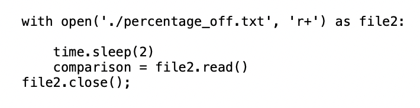
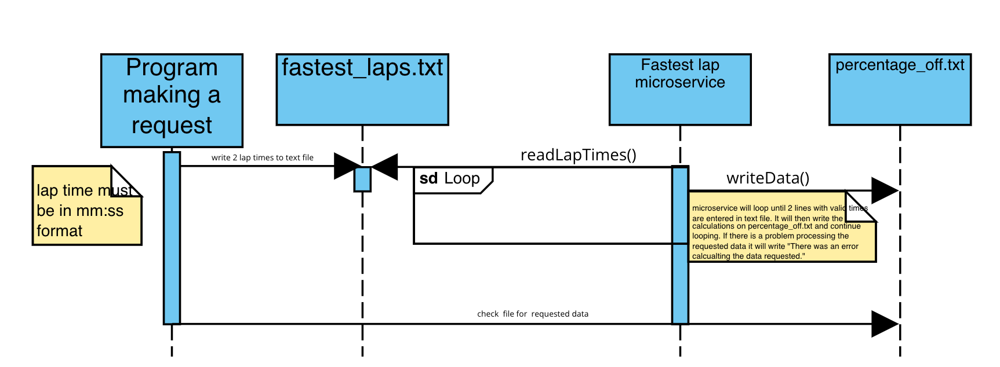

README

Overview:

This was microservice was developed to compare two lap times and return the comparison value in %.
Note ** if text file names are changed, make sure to update file names on fastest_lap_service.py as well to match these. File path and file names must be consistent

Request Data:
1. Run the fastest_lap_microservice.py file -> in your terminal run : python <path-to-fastest_lap_microservice.py>
2. Progammatically write two lap times in the fastest_laps.txt file in minutes:seconds format.
    Note ** times entered must be in two separate lines (line 1: user's time, line 2: fastest time)
    Here is an example of a python program writing to the text file:

    
    
    

3. Wait 2 seconds. The microservice will calculate the values and then clear out the fastest_laps.txt to wait for the next request. 

Receive Data:
1. Once lap times are written on fastest_laps.txt, progammatically read the data from the percentage_off.txt file 
    Here is an example of a python program reading the data form the text file:
    

Troubleshooting:
If data is not getting received, here are a couple of things to watch out for:
a. Check that the main program is running. fastest_lap_microservice.py must be running in order for the microservice to work.
b. Check that the file names are consistent with the fastest_lap_microservice.py file names. Also, make sure that the path to these files listed in fastest_lap_microservice is accurate.
c. Check that the data written on the fastest_laps.txt file is formatted correctly. It should only be line 1: <mm:ss>, line 2:<mm:ss> and nothing else

UML diagram:

